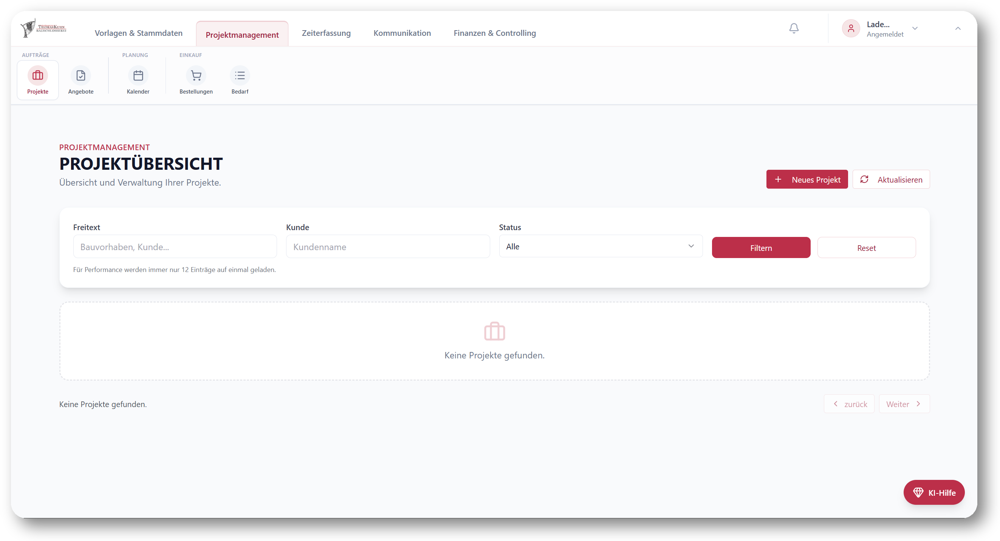
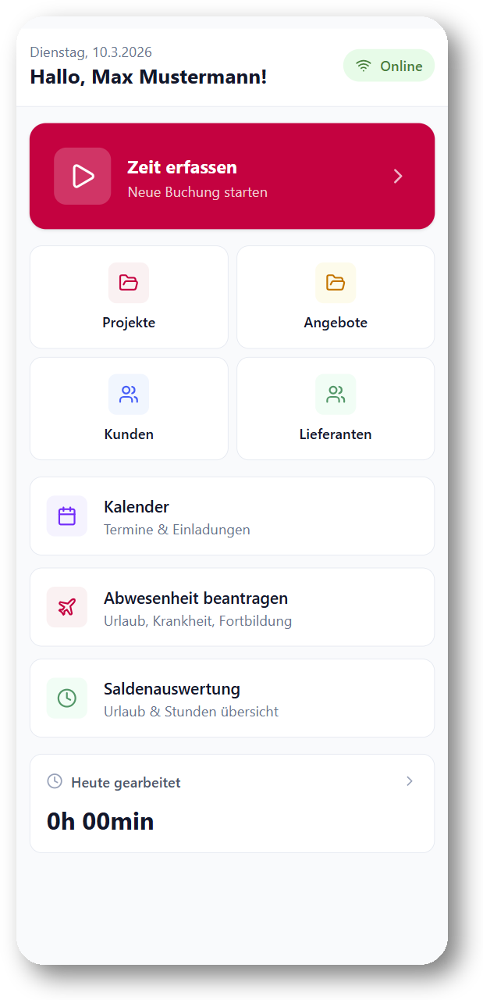
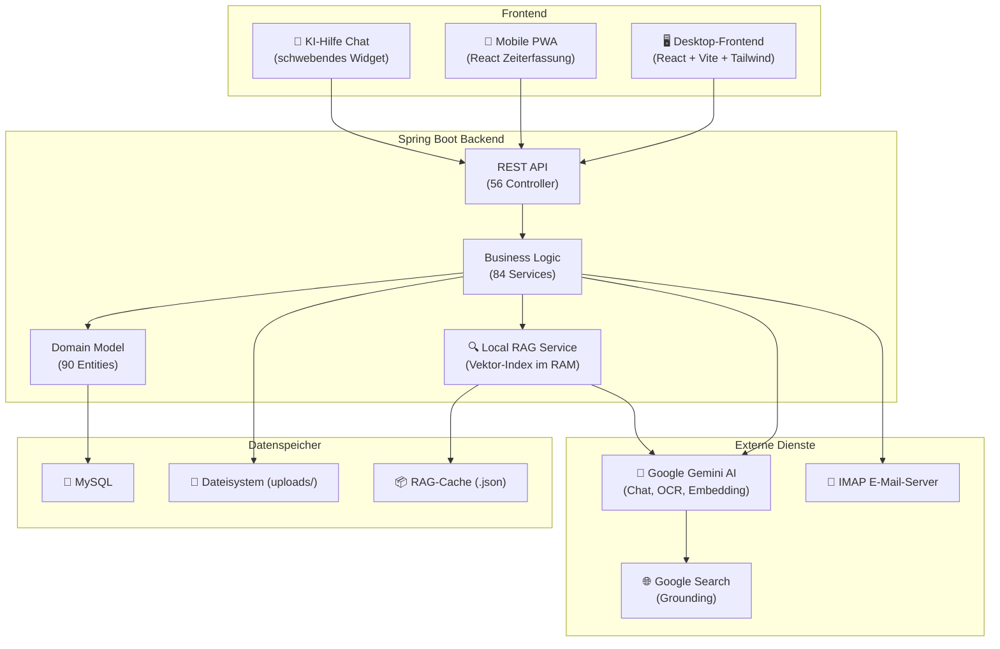

<h1 align="center">Handwerkerprogramm</h1>

<p align="center">
  <strong>Das Open-Source-ERP, das für Handwerksbetriebe gebaut wurde – nicht an sie angepasst.</strong><br/>
  Angebote kalkulieren. Zeiten erfassen. Rechnungen stellen. Projekte nachkalkulieren. Alles in einer Anwendung.
</p>

<p align="center">
  
  
  
  
  
  
  
</p>

<br/>

<p align="center">
  <strong>🖥️ Desktop-Frontend</strong>
</p>
<p align="center">
  
</p>

<br/>

<p align="center">
  <strong>� Automatische Zeitkalkulation per Linearer Regression</strong>
</p>
<p align="center">
  
</p>

<br/>

<p align="center">
  <strong>�📱 Mobile App (PWA)</strong>
</p>
<p align="center">
  
</p>

---

## 🙋 Über dieses Projekt

Ich habe dieses Programm entwickelt, um meinem Vater in seinem Handwerksbetrieb zu helfen. Was als kleines Tool zur Projektkalkulation begann, ist über die Zeit zu einem vollständigen ERP-System gewachsen – mit eingebautem KI-Assistenten, automatischer Zeitkalkulation, Echtzeit-Nachkalkulation, E-Mail-Integration und vielem mehr.

Ich studiere **Wirtschaftsinformatik im 4. Semester** und habe das Projekt durch **Pair-Programming mit Claude (AI)** entwickelt. Jetzt möchte ich es als Open Source verfügbar machen, damit auch andere Handwerksbetriebe davon profitieren können.

---

## 🚀 Was dieses ERP besonders macht

> Die meisten ERP-Systeme sind für Konzerne gebaut und kosten tausende Euro. Dieses hier ist speziell für Handwerksbetriebe entwickelt – mit Features, die echte Probleme aus dem Arbeitsalltag lösen.

### 🧠 KI-Assistent, der das Programm kennt (RAG-basiert)

Kein dummer Chatbot – der eingebaute KI-Assistent **versteht die gesamte Anwendung**:

- **Kontextbewusst:** Die KI sieht, auf welcher Seite du gerade bist, welche Felder sichtbar sind, welche Fehler angezeigt werden und welche Buttons deaktiviert sind – und hilft dir gezielt weiter
- **Retrieval-Augmented Generation (RAG):** Beim Start wird der gesamte Quellcode (Frontend, Backend, Docs) in semantische Chunks aufgeteilt, als Vektoren embedded (Gemini text-embedding-004) und in einem lokalen Vektorindex gespeichert. Bei jeder Nutzerfrage werden die relevantesten Code-Stellen per Cosine-Similarity gefunden und als Kontext an die KI übergeben
- **Google Search Grounding:** Neben Programm-Hilfe beantwortet die KI auch fachliche Fragen – DIN-Normen, Materialeigenschaften, Vorschriften, aktuelle Wetterdaten für Baustellen
- **Überall verfügbar:** Schwebendes Chat-Widget auf jeder Seite, Gesprächsverlauf bleibt erhalten

> Beispiel: „Wie erstelle ich eine Schlussrechnung?" → Die KI findet den relevanten Code, versteht den Workflow und erklärt dir Schritt für Schritt, was zu tun ist.

### ⏱️ Automatische Zeitkalkulation per Lineare Regression

Das System **lernt aus deinen abgeschlossenen Projekten**, wie lange Arbeiten dauern:

- **Datengetriebene Kalkulation:** Für jede Produktkategorie (z. B. „Fenster einbauen", „Flachdach abdichten") werden alle vergangenen Projekte mit Zeitbuchungen analysiert
- **Lineare Regression:** Berechnet automatisch `Fixzeit + Variable Zeit × Menge` – also z. B. „0,5 h Rüstzeit + 1,2 h pro Fenster"
- **Aufschlüsselung nach Arbeitsgang:** Zeigt für jeden Arbeitsgang (Montage, Nacharbeit, Transport) die durchschnittlichen Stunden pro Einheit
- **Interaktives Diagramm:** Scatter-Plot mit Regressionslinie – sofort sichtbar, welche Projekte Ausreißer waren
- **Jahresfilter:** Analysiere nur aktuelle Jahre oder vergleiche die Entwicklung

> Kein manuelles Schätzen mehr – das Programm sagt dir auf Basis echter Daten, wie lange ein Auftrag dauern wird.

### 📊 Echtzeit-Nachkalkulation im Projekt

Jedes Projekt zeigt dir **live**, ob du Geld verdienst oder verlierst:

- **Arbeitskosten:** Die Zeiterfassung der Mitarbeiter (Stunden × Stundensatz) wird automatisch pro Projekt summiert – aufgeschlüsselt nach Kategorie → Arbeitsgang → Mitarbeiter
- **Materialkosten aus 3 Quellen:** Manuelle Einträge + Artikel aus dem Lager + zugeordnete Eingangsrechnungen – alles fließt automatisch zusammen
- **Gewinn-Berechnung:** `Netto-Preis − Arbeitskosten − Materialkosten = Gewinn` – wird rot, wenn negativ
- **8-Tab-Übersicht:** Zeiten, Materialkosten, E-Mails, Geschäftsdokumente, Dateien, Beschreibung, Bautagebuch – alles an einem Ort

> Du siehst sofort: „Bei diesem Projekt sind wir 800 € im Minus, weil der Monteur 12 Stunden länger gebraucht hat als kalkuliert."

### 🛒 Eingangsrechnungen → Projekte & Kostenstellen zuordnen

Lieferantenrechnungen verschwinden nicht in einem Ordner – sie werden **aktiv den richtigen Projekten zugeordnet**:

- **4-Stufen-Bestellkette:** Anfrage → Bestellung → Rechnung eingegangen → Zugeordnet
- **Flexible Aufteilung:** Eine Rechnung kann prozentual oder als absoluter Betrag auf mehrere Projekte und Kostenstellen (Lager, Büro, Versicherung) verteilt werden
- **Automatischer Rest:** Das letzte Projekt bekommt automatisch den Restbetrag – keine Rundungsfehler
- **Sofortige Nachkalkulation:** Die zugeordneten Beträge erscheinen sofort im ProjektEditor unter Materialkosten und aktualisieren die Gewinnberechnung
- **PDF-Verknüpfung:** Die Originalrechnung wird automatisch im Projekt als Eingangsrechnung hinterlegt

> Beispiel: 10.000 € Lieferantenrechnung → 60 % auf „Hausbau Meyer" (6.000 €) + 40 % auf Kostenstelle „Lager" (4.000 €). Sofort sichtbar im Projekt.

### 📬 Eingangsrechnungen automatisch aus dem E-Mail-Postfach

Keine manuelle Ablage mehr – das System **holt sich Lieferantenrechnungen selbstständig**:

- **IMAP-Polling alle 60 Sekunden:** Das System überwacht automatisch das E-Mail-Postfach und erkennt neue Nachrichten
- **Automatische Lieferanten-Zuordnung:** Anhand der Absender-Domain wird die E-Mail dem richtigen Lieferanten zugeordnet
- **KI-Analyse der Anhänge:** PDF-Anhänge werden automatisch analysiert – erst per ZUGFeRD-XML, dann per Gemini AI (OCR-Fallback). Die KI erkennt Dokumenttyp (Rechnung, Lieferschein, Gutschrift), Rechnungsnummer, Beträge und Zahlungsbedingungen
- **Automatische Bestellungs-Verknüpfung:** Erkannte Bestellnummern werden mit offenen Bestellungen abgeglichen – die Rechnung dockt automatisch an die richtige Bestellkette an
- **Direkt verfügbar:** Nach der Analyse erscheint die Rechnung in der Bestellungsübersicht und kann sofort Projekten zugeordnet werden

> Du bestellst Material, der Lieferant schickt die Rechnung per Mail – und das Programm hat sie schon analysiert, dem Lieferanten zugeordnet und an die Bestellung gehängt, bevor du die Mail überhaupt gelesen hast.

### 📱 Mobile App – das Werkzeug für die Baustelle

Die mobile PWA läuft auf **jedem Smartphone im Browser** – kein App Store nötig:

- **Zeiterfassung:** 3-Schritt-Wizard (Projekt → Kategorie → Arbeitsgang), Start/Stop, Projekt-Wechsel mit automatischer Umbuchung
- **Bautagebuch mit Fotos:** Direkt auf der Baustelle Fotos schießen, mit Zeitstempel und Mitarbeitername ins Projekt-Tagebuch laden
- **Kunden- & Lieferanten-Adressen:** Komplettes Adressbuch mit **Click-to-Call**, **SMS**, **E-Mail** und **Google-Maps-Navigation** direkt zur Baustelle oder zum Lieferanten
- **Lieferscheine scannen:** Kamera öffnen, Lieferschein fotografieren, **Perspektivkorrektur** mit Eckpunkten justieren, KI analysiert automatisch Nummer, Datum und Bestellreferenz
- **Reklamation erstellen:** Problem beschreiben, Beweisfotos schießen, mit Lieferschein verknüpfen – alles vom Handy aus
- **Angebote einsehen:** Angebots-Details, Fotos und Bautagebuch auch für Angebote verfügbar
- **Teamkalender:** Wer ist im Urlaub? Wer ist krank? Farbcodierte Übersicht für Woche/Monat
- **Urlaub & Abwesenheiten:** Antrag stellen (Urlaub, Krankheit, Fortbildung, Zeitausgleich), Feiertag-Check, Genehmigungsworkflow
- **Salden-Übersicht:** Soll/Ist-Stunden, Überstunden, Resturlaub, Krankheitstage – alles auf einen Blick
- **Offline-First:** Alle Daten werden in IndexedDB gecacht. Zeitbuchungen, Fotos und Reklamationen werden lokal gespeichert und bei Verbindung automatisch synchronisiert

> Auf der Baustelle kein Internet? Kein Problem. Die App arbeitet offline weiter und synchronisiert alles, sobald wieder Empfang da ist.

---

## ✨ Alle Features im Überblick

### 📊 Projektkalkulation & Controlling
- Hierarchische Produktkategorien (z. B. „Dach > Flachdach") mit Verrechnungseinheiten (m², kg, Stück, lfd. Meter)
- **Erfolgsanalyse-Dashboard** mit Echtzeit-KPIs: Gewinn, Material-/Arbeitskosten, Top-10-Kunden
- Monatlicher Umsatzverlauf mit Vorjahresvergleich
- Regionale Projekt-Heatmap nach PLZ
- Automatische Zeitkalkulation per Linearer Regression auf Produktkategorien

### 📄 Rechnungswesen (GoBD-konform)
- Komplette Dokumentenkette: **Angebot → Auftragsbestätigung → Teilrechnung → Abschlagsrechnung → Schlussrechnung**
- GoBD-konforme Unveränderbarkeit, Löschverbot, Storno-Verfahren und lückenlose Nummerierung
- **Abrechnungsverlauf** mit Restbetrags-Berechnung – verhindert Überabrechnung
- Automatische MwSt-Berechnung, Rechnungsadress-Override, PDF-Generierung
- **ZUGFeRD/XRechnung**-Integration (E-Rechnungen erstellen & lesen)
- Offene-Posten-Verwaltung mit Mahnwesen (3 Stufen)

### 📧 E-Mail-Zentrale & Auto-Import
- IMAP-Import alle 60 Sekunden mit Spam-Filter und Thread-Erkennung
- **Automatische Zuordnung** zu Kunden, Lieferanten und Projekten (per Domain-Matching)
- **Eingangsrechnungen automatisch aus E-Mails:** PDF-Anhänge werden erkannt → per ZUGFeRD/XML oder KI-OCR analysiert → als Lieferantendokument angelegt → mit offenen Bestellungen verknüpft
- Signatur- und Abwesenheitsnotiz-Verwaltung
- **KI-gestütztes E-Mail-Polishing:** Korrigiert Grammatik & Rechtschreibung, behält aber den persönlichen Ton bei

### 📱 Mobile App (PWA) – 18 Seiten
- **Zeiterfassung:** 3-Schritt-Wizard (Projekt → Kategorie → Arbeitsgang), Start/Stop, automatische Umbuchung bei Projekt-Wechsel
- **Offline-fähig** mit IndexedDB-Cache und automatischem Sync bei Reconnect
- **Bautagebuch mit Fotos:** Fotos direkt von der Kamera ins Projekt laden, mit Zeitstempel und Mitarbeitername
- **Lieferschein-Scanner:** Kamera-Scan mit Perspektivkorrektur (Eckpunkte justierbar), KI-Analyse von Nummer, Datum und Bestellreferenz
- **Reklamationen:** Problem beschreiben, Beweisfotos hochladen, mit Lieferschein verknüpfen
- **Kunden- & Lieferantenadressen:** Click-to-Call, SMS, E-Mail, **Google-Maps-Navigation** zur Baustelle
- **Angebote:** Angebots-Details, Fotos und Bautagebuch einsehen
- **Teamkalender:** Farbcodierte Abwesenheiten (Urlaub, Krank, Fortbildung) in Wochen-/Monatsansicht
- **Urlaub & Abwesenheiten:** Anträge stellen mit Feiertag-Check und Genehmigungsworkflow
- **Saldenübersicht:** Soll/Ist-Stunden, Überstunden, Resturlaub, Krankheitstage
- Feiertage (Bayern) automatisch berücksichtigt
- GoBD-konformer **Audit-Trail** für jede Buchungsänderung
- **Automatische Nachkalkulation:** Gebuchte Zeiten fließen direkt in die Gewinn-Berechnung des Projekts

### 🤖 Intelligente Dokumentenverarbeitung
- Automatische Erkennung: ZUGFeRD → XML → **Gemini AI** (OCR-Fallback)
- Lieferantenrechnungen mit Confidence-Score und Verifizierungs-Flag
- **Kopie/Entwurf-Erkennung:** KI erkennt Wasserzeichen wie „Abschrift" oder „Entwurf" automatisch
- Prozentuale oder absolute Projektzuordnung für Eingangsrechnungen
- Gutschrift-Rechnungs-Verknüpfung

### 🛒 Bestellwesen & Eingangsrechnungen
- Offene Artikel pro Projekt sammeln und gruppiert nach Lieferant bestellen
- Kilogramm-Berechnung für Werkstoffe, Schnittformen und Winkel für Profile
- Lieferantenpreise hinterlegen, Bestellungs-PDF generieren
- **4-Stufen-Kette:** Anfrage → Bestellung → Rechnung → Zugeordnet
- **Rechnungssplitting:** Eingangsrechnungen prozentual oder absolut auf Projekte & Kostenstellen verteilen

### 🏠 Mietverwaltung
- Jahres-Nebenkostenabrechnung für Mietobjekte
- Kostenstellen-Verteilung nach Verbrauch oder Fläche
- Zählerstanderfassung (Wasser, Strom, Gas) mit Vorjahresvergleich
- PDF-Generierung für Mieter

### 📝 Dokumentengenerator (WYSIWYG)
- Template-basierte Dokumente mit Platzhaltern (`{{KUNDENNAME}}`, `{{LEISTUNGEN_TABELLE}}`, ...)
- Rich-Text-Editor mit Formatierung, Bildern und Tabellen
- Professionelle PDF-Ausgabe mit Firmenbriefkopf

### 🧠 KI-Assistent & Automatisierung
- **Kontextbewusster Chat-Assistent** mit RAG auf dem gesamten Quellcode
- **Google Search Grounding** für DIN-Normen, Materialinfos und Vorschriften
- **PDF-Analyse** mit Gemini Vision (OCR-Fallback über Ollama)
- **E-Mail-Polishing** – KI verbessert Formulierung, behält den Ton bei
- **Automatische Zeitkalkulation** per Linearer Regression auf Produktkategorien
- **Echtzeit-Nachkalkulation** aus Mitarbeiter-Zeiterfassung + Materialkosten
- **Auto-Import aus E-Mail** – Eingangsrechnungen werden aus dem Postfach geholt, analysiert und Bestellungen zugeordnet

---

## 🔒 Datenschutz & KI-Hinweis

> **Wichtig:** Dieses ERP verarbeitet sensible Geschäftsdaten (Rechnungen, Kundendaten, Mitarbeiterzeiten). Bitte beachte:

- **Lokaler Betrieb empfohlen:** Für maximalen Datenschutz das System im eigenen Netzwerk betreiben – alle Daten bleiben auf deinem Server
- **Google Gemini API:** Die KI-Features (Chat-Assistent, Dokumentenanalyse, E-Mail-Polishing) senden Daten an die Google Gemini API. Stelle sicher, dass du die **EU-Region** verwendest und das **KI-Training auf deinen Daten deaktivierst** (Opt-out in der Google Cloud Console). Gemini-Anfragen über die kostenpflichtige API werden laut Google standardmäßig **nicht** für das Modelltraining verwendet – prüfe dennoch deine Vertragsbedingungen
- **Ohne KI nutzbar:** Alle Kernfunktionen (Rechnungswesen, Zeiterfassung, Bestellwesen) funktionieren **vollständig ohne KI**. Der Gemini-API-Key ist optional – ohne ihn werden die KI-Features einfach deaktiviert
- **DSGVO:** Bei personenbezogenen Daten (Mitarbeiterzeiten, Kundenadressen) gelten die üblichen DSGVO-Pflichten. Da das System Self-Hosted ist, behältst du die volle Kontrolle über deine Daten

---

## 🏗️ Architektur



---

## 🛠️ Tech-Stack

| Schicht | Technologie |
|---------|-------------|
| **Backend** | Java 23, Spring Boot 3.2.5, JPA/Hibernate, Flyway |
| **Datenbank** | MySQL 8 |
| **Desktop-Frontend** | React 18 + TypeScript + Vite + Tailwind CSS |
| **Mobile App** | React PWA (Offline-fähig via IndexedDB) |
| **KI-Assistent** | Google Gemini API (Chat, Vision, Embedding), Google Search Grounding |
| **RAG / Vektorsuche** | Lokaler In-Memory-Vektorindex mit Cosine-Similarity (kein externer Service nötig) |
| **PDF-Generierung** | OpenPDF, Apache PDFBox, Mustang (ZUGFeRD) |
| **E-Mail** | Jakarta Mail (IMAP/SMTP) |
| **Build** | Maven (Backend), Vite (Frontend) |
| **Deployment** | jpackage (Windows EXE), Docker (optional) |

---

## 🚀 Schnellstart

### Voraussetzungen

- **Java 23** (JDK) – [Eclipse Adoptium](https://adoptium.net/)
- **MySQL 8** – Datenbank `kalkulationsprogramm_db` anlegen
- **Node.js 18+** – für die React-Frontends

### 1. Repository klonen

```bash
git clone https://github.com/Winfo2024Kuhn/ERP-System-fuer-Handwerksbetriebe.git
cd ERP-System-fuer-Handwerksbetriebe
```

### 2. Datenbank konfigurieren

Erstelle `src/main/resources/application-local.properties`:

```properties
spring.datasource.url=jdbc:mysql://localhost:3306/kalkulationsprogramm_db
spring.datasource.username=DEIN_USER
spring.datasource.password=DEIN_PASSWORT
```

### 3. Backend starten

```bash
./mvnw spring-boot:run
```

### 4. Firmenlogo hinterlegen

Lege dein eigenes Firmenlogo als **`firmenlogo_icon.png`** in folgendem Ordner ab:

```
react-pc-frontend/public/firmenlogo_icon.png
```

Das Logo wird dann automatisch in der Anwendung (z. B. im Header und auf generierten PDFs) angezeigt.

### 5. Desktop-Frontend starten

```bash
cd react-pc-frontend
npm install
npm run dev
```

### 6. Mobile Zeiterfassung starten (optional)

```bash
cd react-zeiterfassung
npm install
npm run dev
```

---

## �️ Deployment & Betrieb

Das Handwerkerprogramm kann auf zwei Arten betrieben werden: **lokal im Firmennetzwerk** oder auf einem **Cloud-Server**. Beide Varianten werden hier erklärt.

### Gemeinsame Voraussetzungen

| Komponente | Version | Hinweis |
|------------|---------|---------|
| Java (JDK) | 23+ | [Eclipse Adoptium](https://adoptium.net/) |
| MySQL | 8+ | Datenbank `kalkulationsprogramm_db` anlegen |
| Node.js | 18+ | Nur für Frontend-Build nötig |

### Backend für Produktion vorbereiten

```bash
# 1. JAR bauen (inkl. Tests)
./mvnw clean package

# 2. Frontend für Produktion bauen
cd react-pc-frontend && npm install && npm run build
cd ../react-zeiterfassung && npm install && npm run build
```

Das fertige JAR liegt unter `target/kalkulationsprogramm-*.jar`.

### Authentifizierung konfigurieren

Die API ist **standardmäßig per HTTP Basic Auth geschützt**. Admin-Zugangsdaten werden über Umgebungsvariablen gesetzt:

```powershell
# Windows (PowerShell)
$env:APP_ADMIN_USER = "meinBenutzername"
$env:APP_ADMIN_PASS = "sicheresPasswort123!"
```

```bash
# Linux / macOS
export APP_ADMIN_USER="meinBenutzername"
export APP_ADMIN_PASS="sicheresPasswort123!"
```

> ⚠️ **Wichtig:** Ändere unbedingt die Standard-Zugangsdaten (`admin` / `changeme`) vor dem produktiven Einsatz!

---

### Option A: Lokaler Betrieb (Firmenserver / eigener Rechner)

Ideal, wenn alle Nutzer im **gleichen Netzwerk (LAN/WLAN)** arbeiten – z. B. im Büro oder in der Werkstatt.

#### 1. MySQL einrichten

```sql
CREATE DATABASE kalkulationsprogramm_db
  CHARACTER SET utf8mb4
  COLLATE utf8mb4_german2_ci;
CREATE USER 'erp'@'localhost' IDENTIFIED BY 'DEIN_DB_PASSWORT';
GRANT ALL PRIVILEGES ON kalkulationsprogramm_db.* TO 'erp'@'localhost';
```

#### 2. Konfiguration anpassen

Erstelle `src/main/resources/application-local.properties`:

```properties
spring.datasource.url=jdbc:mysql://localhost:3306/kalkulationsprogramm_db?useUnicode=true&characterEncoding=UTF-8
spring.datasource.username=erp
spring.datasource.password=DEIN_DB_PASSWORT
```

#### 3. Server starten

```powershell
# Umgebungsvariablen setzen
$env:APP_ADMIN_USER = "admin"
$env:APP_ADMIN_PASS = "deinSicheresPasswort"

# JAR starten
java -jar target/kalkulationsprogramm-*.jar --spring.profiles.active=local
```

#### 4. Zugriff im Netzwerk

| Nutzer | URL |
|--------|-----|
| Gleicher Rechner | `http://localhost:8080` |
| Anderer PC im LAN | `http://192.168.x.x:8080` (IP des Servers) |
| Zeiterfassung (Handy) | `http://192.168.x.x:8080/zeiterfassung` |

> 💡 **Tipp:** Unter Windows die IP mit `ipconfig` herausfinden. Stelle sicher, dass Port 8080 in der Windows-Firewall freigegeben ist.

---

### Option B: Cloud-Server (VPS / Cloudrechner)

Für den Zugriff **von unterwegs oder von Baustellen** – z. B. auf einem VPS bei Hetzner, Netcup oder DigitalOcean.

> ⚠️ **Sicherheitshinweis:** Einen Server ohne Absicherung ins Internet zu stellen ist gefährlich! Wähle mindestens **eine** der folgenden Absicherungen:

#### Variante 1: VPN mit Tailscale (empfohlen für Einsteiger)

Mit [Tailscale](https://tailscale.com/) wird ein privates Netzwerk aufgebaut – der Server ist **nicht öffentlich** erreichbar, nur über das VPN.

**Auf dem Cloud-Server:**
```bash
# Tailscale installieren (Ubuntu/Debian)
curl -fsSL https://tailscale.com/install.sh | sh
sudo tailscale up

# Handwerkerprogramm starten
java -jar kalkulationsprogramm-*.jar
```

**Auf jedem Client (PC, Handy):**
1. Tailscale App installieren ([tailscale.com/download](https://tailscale.com/download))
2. Mit dem gleichen Konto anmelden
3. Zugriff über die Tailscale-IP: `http://100.x.x.x:8080`

**Vorteile:** Einfachste Einrichtung, kein Port öffnen, automatische Verschlüsselung, kostenlos für kleine Teams (bis 100 Geräte).

**Optional – HTTPS innerhalb von Tailscale aktivieren:**
```bash
# Auf dem Server: Tailscale HTTPS-Zertifikat anfordern
sudo tailscale cert mein-server.tail-xxxx.ts.net

# Spring Boot mit HTTPS starten
java -jar kalkulationsprogramm-*.jar \
  --server.ssl.certificate=mein-server.tail-xxxx.ts.net.crt \
  --server.ssl.certificate-private-key=mein-server.tail-xxxx.ts.net.key \
  --server.port=8443
```

Dann erreichbar über: `https://mein-server.tail-xxxx.ts.net:8443`

---

#### Variante 2: HTTPS mit Reverse Proxy (für öffentlichen Zugriff)

Wenn der Server **öffentlich erreichbar** sein soll (z. B. für Kunden-Zeiterfassung), nutze einen Reverse Proxy mit automatischem SSL-Zertifikat.

**Mit Caddy (empfohlen – automatisches HTTPS):**

```bash
# Caddy installieren (Ubuntu/Debian)
sudo apt install -y caddy
```

Erstelle `/etc/caddy/Caddyfile`:
```
erp.meinefirma.de {
    reverse_proxy localhost:8080
}
```

```bash
sudo systemctl restart caddy
```

Caddy holt sich automatisch ein Let's-Encrypt-Zertifikat. Die Anwendung ist dann unter `https://erp.meinefirma.de` erreichbar.

> 📋 **Voraussetzung:** Eine Domain (z. B. `erp.meinefirma.de`) muss per DNS-A-Record auf die Server-IP zeigen.

**Zusätzliche Absicherung für öffentliche Server:**
- Starkes Admin-Passwort setzen (mind. 16 Zeichen)
- SSH nur mit Key-Login (Passwort-Login deaktivieren)
- Firewall: nur Port 80, 443 und SSH offen (`ufw allow 80,443,22/tcp`)
- Fail2Ban installieren gegen Brute-Force-Angriffe
- Regelmäßige Datenbank-Backups (siehe `deployment/scripts/backup-database.ps1`)

---

#### Variante 3: Cloudflare Tunnel (kein Port öffnen, kein VPN nötig)

[Cloudflare Tunnel](https://developers.cloudflare.com/cloudflare-one/connections/connect-networks/) macht den lokalen Server über eine Cloudflare-Domain erreichbar, **ohne Ports zu öffnen**.

```bash
# cloudflared installieren
curl -fsSL https://pkg.cloudflare.com/cloudflare-main.gpg | sudo tee /usr/share/keyrings/cloudflare.gpg
sudo apt install cloudflared

# Tunnel erstellen und konfigurieren
cloudflared tunnel login
cloudflared tunnel create handwerkerprogramm
cloudflared tunnel route dns handwerkerprogramm erp.meinefirma.de

# Tunnel starten
cloudflared tunnel --url http://localhost:8080 run handwerkerprogramm
```

**Vorteile:** Kein Port öffnen, automatisches HTTPS, DDoS-Schutz inklusive, kostenloser Tarif verfügbar.

---

### Übersicht: Welche Variante passt zu mir?

| Kriterium | LAN (lokal) | Tailscale VPN | HTTPS + Reverse Proxy | Cloudflare Tunnel |
|-----------|:-----------:|:-------------:|:---------------------:|:-----------------:|
| Einrichtung | ⭐ Einfach | ⭐ Einfach | ⭐⭐ Mittel | ⭐⭐ Mittel |
| Kosten | Keine | Kostenlos | Domain nötig (~1 €/M.) | Domain nötig |
| Zugriff von unterwegs | ❌ | ✅ | ✅ | ✅ |
| Öffentlich erreichbar | ❌ | ❌ | ✅ | ✅ |
| HTTPS | Nicht nötig | Optional | ✅ Automatisch | ✅ Automatisch |
| Port öffnen | Nur LAN | Kein Port | Port 80 + 443 | Kein Port |

---

## �📁 Projektstruktur

```
Handwerkerprogramm/
├── src/main/java/.../kalkulationsprogramm/
│   ├── controller/          # 56 REST-Controller
│   ├── service/             # 84 Business-Services
│   │   ├── KiHilfeService         # KI-Chat mit RAG + Google Search
│   │   ├── LocalRagService        # Vektor-Embedding & Similarity Search
│   │   ├── GeminiDokumentAnalyseService  # KI-Rechnungserkennung
│   │   ├── ProduktkategorieService       # Zeitkalkulation (Regression)
│   │   └── EmailAiService         # KI-E-Mail-Polishing
│   ├── repository/          # Spring Data Repositories
│   ├── domain/              # 90 JPA-Entities
│   ├── dto/                 # API-Datenmodelle
│   ├── config/              # Spring-Konfiguration
│   └── mapper/              # DTO ↔ Entity Mapper
│
├── react-pc-frontend/       # 🖥️ Desktop-UI (31 Seiten)
│   └── src/
│       ├── pages/           # Editoren, Dashboards, Tools
│       └── components/
│           └── KiHilfeChat  # 🧠 Schwebendes KI-Widget
│
├── react-zeiterfassung/     # 📱 Mobile PWA (18 Seiten)
│   └── src/pages/           # Stempeluhr, Urlaub, Salden
│
├── docs/                    # 📚 Dokumentation
│   ├── GOBD_COMPLIANCE.md   # GoBD-Konformität
│   ├── RECHNUNGSWESEN.md    # Rechnungsprozesse
│   ├── DOKUMENTEN_LIFECYCLE.md
│   └── ...
│
├── deployment/              # 🚀 Deployment-Scripts
│   └── scripts/             # Backup, Autostart, Restart
│
└── docker-compose.yml       # Qdrant Vector DB (optional)
```

---

## 📚 Dokumentation

Die vollständige Dokumentation befindet sich im [`docs/`](docs/) Verzeichnis:

| Dokument | Beschreibung |
|----------|--------------|
| [BUSINESS_CASES.md](docs/BUSINESS_CASES.md) | Geschäftsnutzen aller Module |
| [GOBD_COMPLIANCE.md](docs/GOBD_COMPLIANCE.md) | GoBD-Konformität & Audit-Trail |
| [RECHNUNGSWESEN.md](docs/RECHNUNGSWESEN.md) | Kompletter Rechnungsprozess |
| [DOKUMENTEN_LIFECYCLE.md](docs/DOKUMENTEN_LIFECYCLE.md) | Lebenszyklus aller Dokumente |
| [ZEITERFASSUNG_WORKFLOWS.md](docs/ZEITERFASSUNG_WORKFLOWS.md) | Zeiterfassung Online & Offline |
| [DOKUMENTATIONSPLAN.md](docs/DOKUMENTATIONSPLAN.md) | Übersicht & Roadmap der Docs |

Architektur-Diagramme (draw.io) liegen in [`docs/Dokumentation/`](docs/Dokumentation/).

---

## 📊 Projekt in Zahlen

| Metrik | Wert |
|--------|------|
| REST-Controller | 56 |
| Business-Services | 84 |
| Domain-Entities | 90 |
| Desktop-Seiten (PC) | 31 |
| Mobile-Seiten (PWA) | 18 |
| Dokumentationen | 7 |
| Architektur-Diagramme | 7 |

---

## 🔧 Build & Deployment

```bash
# Tests ausführen
./mvnw test

# JAR bauen
./mvnw clean package

# Windows-Installer erzeugen
./mvnw package
./mvnw jpackage:jpackage
# → Installer liegt in target/installer/

# Frontend für Produktion bauen
cd react-pc-frontend && npm run build
```

Detaillierte Deployment-Anleitung: [`deployment/README.md`](deployment/README.md)

---

## 🤝 Beitragen

Beiträge sind willkommen! Dieses Projekt lebt davon, dass Handwerksbetriebe und Entwickler zusammenarbeiten.

1. Fork erstellen
2. Feature-Branch anlegen (`git checkout -b feature/mein-feature`)
3. Änderungen committen (`git commit -m 'Neues Feature hinzugefügt'`)
4. Branch pushen (`git push origin feature/mein-feature`)
5. Pull Request erstellen

### Entwicklungsrichtlinien

- **Backend:** Java-Konventionen, Constructor Injection, Tests sind Pflicht
- **Frontend:** React + TypeScript, Rose/Rot-Farbschema, deutsche UI-Texte
- **Tests:** JUnit 5 + Mockito (Backend), Vitest + Testing Library (Frontend)
- **Sicherheit:** OWASP Top 10, parametrisierte Queries, Input-Validierung

---

## 📜 Lizenz

Dieses Projekt steht unter der [MIT-Lizenz](LICENSE).

---

<p align="center">
  Gebaut mit ❤️, ☕ und KI-Unterstützung<br/>
  <sub>Von einem Wirtschaftsinformatik-Studenten für den Handwerksbetrieb seines Vaters – jetzt Open Source für alle.</sub>
</p>
