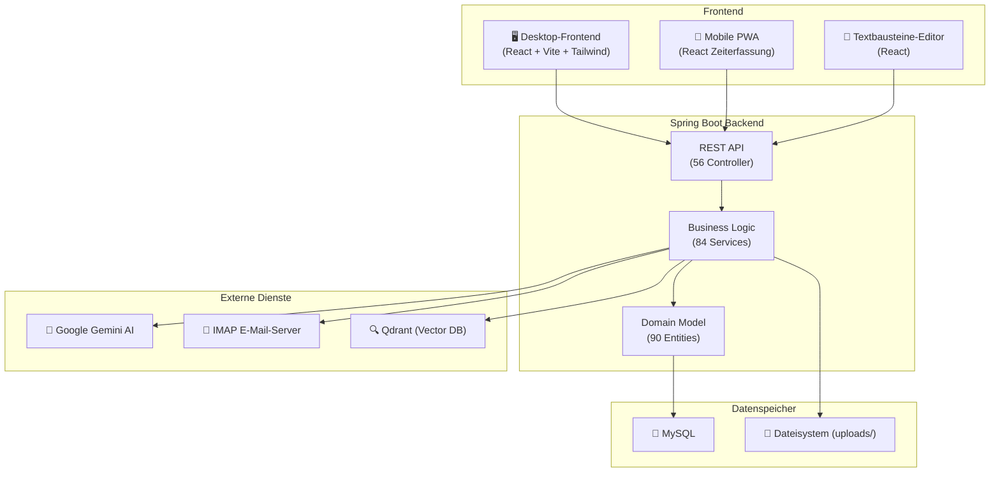

<h1 align="center">Handwerkerprogramm</h1>

<p align="center">
  <strong>Open-Source-ERP für Handwerksbetriebe</strong><br/>
  Von der Angebotserstellung über die Zeiterfassung bis zur Schlussrechnung – alles in einer Anwendung.
</p>

<p align="center">
  
  
  
  
  
  
</p>

---

## 🙋 Über dieses Projekt

Ich habe dieses Programm ursprünglich entwickelt, um meinem Vater in seinem Handwerksbetrieb zu helfen. Was als kleines Tool zur Projektkalkulation begann, ist über die Zeit zu einem vollständigen ERP-System gewachsen – mit Rechnungswesen, Zeiterfassung, E-Mail-Integration und vielem mehr.

Ich studiere **Wirtschaftsinformatik im 4. Semester** und habe das Projekt durch **Pair-Programming mit Claude (AI)** entwickelt. Jetzt möchte ich es als Open Source verfügbar machen, damit auch andere Handwerksbetriebe davon profitieren können.

---

## ✨ Features

### 📊 Projektkalkulation & Controlling
- Hierarchische Produktkategorien (z. B. „Dach > Flachdach") mit Verrechnungseinheiten (m², kg, Stück, lfd. Meter)
- **Erfolgsanalyse-Dashboard** mit Echtzeit-KPIs: Gewinn, Material-/Arbeitskosten, Top-10-Kunden
- Monatlicher Umsatzverlauf mit Vorjahresvergleich
- Regionale Projekt-Heatmap nach PLZ

### 📄 Rechnungswesen (GoBD-konform)
- Komplette Dokumentenkette: **Angebot → Auftragsbestätigung → Abschlagsrechnungen → Schlussrechnung**
- GoBD-konforme Unveränderbarkeit, Löschverbot, Storno-Verfahren und lückenlose Nummerierung
- Automatische MwSt-Berechnung, Rechnungsadress-Override, PDF-Generierung
- **ZUGFeRD/XRechnung**-Integration (E-Rechnungen erstellen & lesen)
- Offene-Posten-Verwaltung mit Mahnwesen (3 Stufen)

### 📧 E-Mail-Zentrale
- IMAP-Import alle 60 Sekunden mit Spam-Filter und Thread-Erkennung
- **Automatische Zuordnung** zu Kunden, Lieferanten und Projekten
- Anhänge werden als Lieferantendokumente analysiert (ZUGFeRD / KI)
- Signatur- und Abwesenheitsnotiz-Verwaltung
- KI-gestützte E-Mail-Formulierung (Ollama / Gemini)

### ⏱️ Mobile Zeiterfassung (PWA)
- Start/Stop-Stempelung auf Projekt + Kategorie + Arbeitsgang
- **Offline-fähig** mit automatischem Sync bei Reconnect
- Saldenauswertung (Soll/Ist, Überstunden, Zeitausgleich)
- Urlaubsanträge mit Genehmigungsworkflow
- Feiertage (Bayern) automatisch berücksichtigt
- GoBD-konformer **Audit-Trail** für jede Buchungsänderung

### 🤖 Intelligente Dokumentenverarbeitung
- Automatische Erkennung: ZUGFeRD → XML → **Gemini AI** (OCR-Fallback)
- Lieferantenrechnungen mit Confidence-Score und Verifizierungs-Flag
- Prozentuale Projektzuordnung für Eingangsrechnungen
- Gutschrift-Rechnungs-Verknüpfung

### 🛒 Bestellwesen
- Offene Artikel pro Projekt sammeln und gruppiert nach Lieferant bestellen
- Kilogramm-Berechnung für Werkstoffe, Schnittformen und Winkel für Profile
- Lieferantenpreise hinterlegen, Bestellungs-PDF generieren

### 🏠 Mietverwaltung
- Jahres-Nebenkostenabrechnung für Mietobjekte
- Kostenstellen-Verteilung nach Verbrauch oder Fläche
- Zählerstanderfassung (Wasser, Strom, Gas) mit Vorjahresvergleich
- PDF-Generierung für Mieter

### 📝 Dokumentengenerator (WYSIWYG)
- Template-basierte Dokumente mit Platzhaltern (`{{KUNDENNAME}}`, `{{LEISTUNGEN_TABELLE}}`, ...)
- Rich-Text-Editor mit Formatierung, Bildern und Tabellen
- Professionelle PDF-Ausgabe mit Firmenbriefkopf

---

## 🏗️ Architektur



---

## 🛠️ Tech-Stack

| Schicht | Technologie |
|---------|-------------|
| **Backend** | Java 23, Spring Boot 3.2.5, JPA/Hibernate, Flyway |
| **Datenbank** | MySQL 8 |
| **Desktop-Frontend** | React 18 + TypeScript + Vite + Tailwind CSS |
| **Mobile App** | React PWA (Offline-fähig via IndexedDB) |
| **PDF-Generierung** | OpenPDF, Apache PDFBox, Mustang (ZUGFeRD) |
| **KI-Integration** | Google Gemini API, Ollama (optional) |
| **E-Mail** | Jakarta Mail (IMAP/SMTP) |
| **Suche** | Qdrant Vector Database |
| **Build** | Maven (Backend), Vite (Frontend) |
| **Deployment** | jpackage (Windows EXE), Docker (optional) |

---

## 🚀 Schnellstart

### Voraussetzungen

- **Java 23** (JDK) – [Eclipse Adoptium](https://adoptium.net/)
- **MySQL 8** – Datenbank `kalkulationsprogramm_db` anlegen
- **Node.js 18+** – für die React-Frontends

### 1. Repository klonen

```bash
git clone https://github.com/Winfo2024Kuhn/ERP-System-fuer-Handwerksbetriebe.git
cd ERP-System-fuer-Handwerksbetriebe
```

### 2. Datenbank konfigurieren

Erstelle `src/main/resources/application-local.properties`:

```properties
spring.datasource.url=jdbc:mysql://localhost:3306/kalkulationsprogramm_db
spring.datasource.username=DEIN_USER
spring.datasource.password=DEIN_PASSWORT
```

### 3. Backend starten

```bash
./mvnw spring-boot:run
```

### 4. Desktop-Frontend starten

```bash
cd react-pc-frontend
npm install
npm run dev
```

### 5. Mobile Zeiterfassung starten (optional)

```bash
cd react-zeiterfassung
npm install
npm run dev
```

---

## �️ Deployment & Betrieb

Das Handwerkerprogramm kann auf zwei Arten betrieben werden: **lokal im Firmennetzwerk** oder auf einem **Cloud-Server**. Beide Varianten werden hier erklärt.

### Gemeinsame Voraussetzungen

| Komponente | Version | Hinweis |
|------------|---------|---------|
| Java (JDK) | 23+ | [Eclipse Adoptium](https://adoptium.net/) |
| MySQL | 8+ | Datenbank `kalkulationsprogramm_db` anlegen |
| Node.js | 18+ | Nur für Frontend-Build nötig |

### Backend für Produktion vorbereiten

```bash
# 1. JAR bauen (inkl. Tests)
./mvnw clean package

# 2. Frontend für Produktion bauen
cd react-pc-frontend && npm install && npm run build
cd ../react-zeiterfassung && npm install && npm run build
```

Das fertige JAR liegt unter `target/kalkulationsprogramm-*.jar`.

### Authentifizierung konfigurieren

Die API ist **standardmäßig per HTTP Basic Auth geschützt**. Admin-Zugangsdaten werden über Umgebungsvariablen gesetzt:

```powershell
# Windows (PowerShell)
$env:APP_ADMIN_USER = "meinBenutzername"
$env:APP_ADMIN_PASS = "sicheresPasswort123!"
```

```bash
# Linux / macOS
export APP_ADMIN_USER="meinBenutzername"
export APP_ADMIN_PASS="sicheresPasswort123!"
```

> ⚠️ **Wichtig:** Ändere unbedingt die Standard-Zugangsdaten (`admin` / `changeme`) vor dem produktiven Einsatz!

---

### Option A: Lokaler Betrieb (Firmenserver / eigener Rechner)

Ideal, wenn alle Nutzer im **gleichen Netzwerk (LAN/WLAN)** arbeiten – z. B. im Büro oder in der Werkstatt.

#### 1. MySQL einrichten

```sql
CREATE DATABASE kalkulationsprogramm_db
  CHARACTER SET utf8mb4
  COLLATE utf8mb4_german2_ci;
CREATE USER 'erp'@'localhost' IDENTIFIED BY 'DEIN_DB_PASSWORT';
GRANT ALL PRIVILEGES ON kalkulationsprogramm_db.* TO 'erp'@'localhost';
```

#### 2. Konfiguration anpassen

Erstelle `src/main/resources/application-local.properties`:

```properties
spring.datasource.url=jdbc:mysql://localhost:3306/kalkulationsprogramm_db?useUnicode=true&characterEncoding=UTF-8
spring.datasource.username=erp
spring.datasource.password=DEIN_DB_PASSWORT
```

#### 3. Server starten

```powershell
# Umgebungsvariablen setzen
$env:APP_ADMIN_USER = "admin"
$env:APP_ADMIN_PASS = "deinSicheresPasswort"

# JAR starten
java -jar target/kalkulationsprogramm-*.jar --spring.profiles.active=local
```

#### 4. Zugriff im Netzwerk

| Nutzer | URL |
|--------|-----|
| Gleicher Rechner | `http://localhost:8080` |
| Anderer PC im LAN | `http://192.168.x.x:8080` (IP des Servers) |
| Zeiterfassung (Handy) | `http://192.168.x.x:8080/zeiterfassung` |

> 💡 **Tipp:** Unter Windows die IP mit `ipconfig` herausfinden. Stelle sicher, dass Port 8080 in der Windows-Firewall freigegeben ist.

---

### Option B: Cloud-Server (VPS / Cloudrechner)

Für den Zugriff **von unterwegs oder von Baustellen** – z. B. auf einem VPS bei Hetzner, Netcup oder DigitalOcean.

> ⚠️ **Sicherheitshinweis:** Einen Server ohne Absicherung ins Internet zu stellen ist gefährlich! Wähle mindestens **eine** der folgenden Absicherungen:

#### Variante 1: VPN mit Tailscale (empfohlen für Einsteiger)

Mit [Tailscale](https://tailscale.com/) wird ein privates Netzwerk aufgebaut – der Server ist **nicht öffentlich** erreichbar, nur über das VPN.

**Auf dem Cloud-Server:**
```bash
# Tailscale installieren (Ubuntu/Debian)
curl -fsSL https://tailscale.com/install.sh | sh
sudo tailscale up

# Handwerkerprogramm starten
java -jar kalkulationsprogramm-*.jar
```

**Auf jedem Client (PC, Handy):**
1. Tailscale App installieren ([tailscale.com/download](https://tailscale.com/download))
2. Mit dem gleichen Konto anmelden
3. Zugriff über die Tailscale-IP: `http://100.x.x.x:8080`

**Vorteile:** Einfachste Einrichtung, kein Port öffnen, automatische Verschlüsselung, kostenlos für kleine Teams (bis 100 Geräte).

**Optional – HTTPS innerhalb von Tailscale aktivieren:**
```bash
# Auf dem Server: Tailscale HTTPS-Zertifikat anfordern
sudo tailscale cert mein-server.tail-xxxx.ts.net

# Spring Boot mit HTTPS starten
java -jar kalkulationsprogramm-*.jar \
  --server.ssl.certificate=mein-server.tail-xxxx.ts.net.crt \
  --server.ssl.certificate-private-key=mein-server.tail-xxxx.ts.net.key \
  --server.port=8443
```

Dann erreichbar über: `https://mein-server.tail-xxxx.ts.net:8443`

---

#### Variante 2: HTTPS mit Reverse Proxy (für öffentlichen Zugriff)

Wenn der Server **öffentlich erreichbar** sein soll (z. B. für Kunden-Zeiterfassung), nutze einen Reverse Proxy mit automatischem SSL-Zertifikat.

**Mit Caddy (empfohlen – automatisches HTTPS):**

```bash
# Caddy installieren (Ubuntu/Debian)
sudo apt install -y caddy
```

Erstelle `/etc/caddy/Caddyfile`:
```
erp.meinefirma.de {
    reverse_proxy localhost:8080
}
```

```bash
sudo systemctl restart caddy
```

Caddy holt sich automatisch ein Let's-Encrypt-Zertifikat. Die Anwendung ist dann unter `https://erp.meinefirma.de` erreichbar.

> 📋 **Voraussetzung:** Eine Domain (z. B. `erp.meinefirma.de`) muss per DNS-A-Record auf die Server-IP zeigen.

**Zusätzliche Absicherung für öffentliche Server:**
- Starkes Admin-Passwort setzen (mind. 16 Zeichen)
- SSH nur mit Key-Login (Passwort-Login deaktivieren)
- Firewall: nur Port 80, 443 und SSH offen (`ufw allow 80,443,22/tcp`)
- Fail2Ban installieren gegen Brute-Force-Angriffe
- Regelmäßige Datenbank-Backups (siehe `deployment/scripts/backup-database.ps1`)

---

#### Variante 3: Cloudflare Tunnel (kein Port öffnen, kein VPN nötig)

[Cloudflare Tunnel](https://developers.cloudflare.com/cloudflare-one/connections/connect-networks/) macht den lokalen Server über eine Cloudflare-Domain erreichbar, **ohne Ports zu öffnen**.

```bash
# cloudflared installieren
curl -fsSL https://pkg.cloudflare.com/cloudflare-main.gpg | sudo tee /usr/share/keyrings/cloudflare.gpg
sudo apt install cloudflared

# Tunnel erstellen und konfigurieren
cloudflared tunnel login
cloudflared tunnel create handwerkerprogramm
cloudflared tunnel route dns handwerkerprogramm erp.meinefirma.de

# Tunnel starten
cloudflared tunnel --url http://localhost:8080 run handwerkerprogramm
```

**Vorteile:** Kein Port öffnen, automatisches HTTPS, DDoS-Schutz inklusive, kostenloser Tarif verfügbar.

---

### Übersicht: Welche Variante passt zu mir?

| Kriterium | LAN (lokal) | Tailscale VPN | HTTPS + Reverse Proxy | Cloudflare Tunnel |
|-----------|:-----------:|:-------------:|:---------------------:|:-----------------:|
| Einrichtung | ⭐ Einfach | ⭐ Einfach | ⭐⭐ Mittel | ⭐⭐ Mittel |
| Kosten | Keine | Kostenlos | Domain nötig (~1 €/M.) | Domain nötig |
| Zugriff von unterwegs | ❌ | ✅ | ✅ | ✅ |
| Öffentlich erreichbar | ❌ | ❌ | ✅ | ✅ |
| HTTPS | Nicht nötig | Optional | ✅ Automatisch | ✅ Automatisch |
| Port öffnen | Nur LAN | Kein Port | Port 80 + 443 | Kein Port |

---

## �📁 Projektstruktur

```
Handwerkerprogramm/
├── src/main/java/.../kalkulationsprogramm/
│   ├── controller/          # 56 REST-Controller
│   ├── service/             # 84 Business-Services
│   ├── repository/          # Spring Data Repositories
│   ├── domain/              # 90 JPA-Entities
│   ├── dto/                 # API-Datenmodelle
│   ├── config/              # Spring-Konfiguration
│   └── mapper/              # DTO ↔ Entity Mapper
│
├── react-pc-frontend/       # 🖥️ Desktop-UI (31 Seiten)
│   └── src/pages/           # Editoren, Dashboards, Tools
│
├── react-zeiterfassung/     # 📱 Mobile PWA (18 Seiten)
│   └── src/pages/           # Stempeluhr, Urlaub, Salden
│
├── docs/                    # 📚 Dokumentation
│   ├── GOBD_COMPLIANCE.md   # GoBD-Konformität
│   ├── RECHNUNGSWESEN.md    # Rechnungsprozesse
│   ├── DOKUMENTEN_LIFECYCLE.md
│   └── ...
│
├── deployment/              # 🚀 Deployment-Scripts
│   └── scripts/             # Backup, Autostart, Restart
│
└── docker-compose.yml       # Qdrant Vector DB
```

---

## 📚 Dokumentation

Die vollständige Dokumentation befindet sich im [`docs/`](docs/) Verzeichnis:

| Dokument | Beschreibung |
|----------|--------------|
| [BUSINESS_CASES.md](docs/BUSINESS_CASES.md) | Geschäftsnutzen aller Module |
| [GOBD_COMPLIANCE.md](docs/GOBD_COMPLIANCE.md) | GoBD-Konformität & Audit-Trail |
| [RECHNUNGSWESEN.md](docs/RECHNUNGSWESEN.md) | Kompletter Rechnungsprozess |
| [DOKUMENTEN_LIFECYCLE.md](docs/DOKUMENTEN_LIFECYCLE.md) | Lebenszyklus aller Dokumente |
| [ZEITERFASSUNG_WORKFLOWS.md](docs/ZEITERFASSUNG_WORKFLOWS.md) | Zeiterfassung Online & Offline |
| [DOKUMENTATIONSPLAN.md](docs/DOKUMENTATIONSPLAN.md) | Übersicht & Roadmap der Docs |

Architektur-Diagramme (draw.io) liegen in [`docs/Dokumentation/`](docs/Dokumentation/).

---

## 📊 Projekt in Zahlen

| Metrik | Wert |
|--------|------|
| REST-Controller | 56 |
| Business-Services | 84 |
| Domain-Entities | 90 |
| Desktop-Seiten (PC) | 31 |
| Mobile-Seiten (PWA) | 18 |
| Dokumentationen | 7 |
| Architektur-Diagramme | 7 |

---

## 🔧 Build & Deployment

```bash
# Tests ausführen
./mvnw test

# JAR bauen
./mvnw clean package

# Windows-Installer erzeugen
./mvnw package
./mvnw jpackage:jpackage
# → Installer liegt in target/installer/

# Frontend für Produktion bauen
cd react-pc-frontend && npm run build
```

Detaillierte Deployment-Anleitung: [`deployment/README.md`](deployment/README.md)

---

## 🤝 Beitragen

Beiträge sind willkommen! Dieses Projekt lebt davon, dass Handwerksbetriebe und Entwickler zusammenarbeiten.

1. Fork erstellen
2. Feature-Branch anlegen (`git checkout -b feature/mein-feature`)
3. Änderungen committen (`git commit -m 'Neues Feature hinzugefügt'`)
4. Branch pushen (`git push origin feature/mein-feature`)
5. Pull Request erstellen

### Entwicklungsrichtlinien

- **Backend:** Java-Konventionen, Constructor Injection, Tests sind Pflicht
- **Frontend:** React + TypeScript, Rose/Rot-Farbschema, deutsche UI-Texte
- **Tests:** JUnit 5 + Mockito (Backend), Vitest + Testing Library (Frontend)
- **Sicherheit:** OWASP Top 10, parametrisierte Queries, Input-Validierung

---

## 📜 Lizenz

Dieses Projekt steht unter der [MIT-Lizenz](LICENSE).

---

<p align="center">
  Gebaut mit ❤️, ☕ und KI-Unterstützung
</p>
